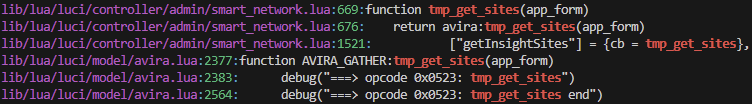

<h1>TP-Link Archer Router RCE</h1>

&nbsp;
<h2>>취약점 정보</h2>> 

CVE-2024-53375<br>
TP-Link Archer Router<br> 
유형: OS Command Injection<br>
대상: AXE75 Router Firmware<br>

&nbsp;
<h2>>환경 빌드</h2>>


<h4>펌웨어 링크</h4>
<link>https://www.tp-link.com/kr/support/download/archer-axe75/#Firmware</link>

1. 펌웨어 다운로드
2. binwalk로 라우터 파일 시스템 추출
    
    ```python
    binwalk -e 펌웨어.bin
    ```
    
3. squash-fs 

&nbsp;
<h2>>취약점 식별</h2>

```python
function AVIRA_GATHER:tmp_get_sites(app_form)
	local data = json.decode(app_form.data)
	local res = {}
	local result = {}

	debug("")
	debug("===> opcode 0x0523: tmp_get_sites")

	local ownerId = data.ownerId	--int
	local day = data.date			--string, today/yesterday
	local siteType = data.type		--string website type, block/visit
	local startIndex = data.startIndex	--int
	local amount = data.amount		--int

	-- NOTE: get response data
	-- PROC_PCTL	= "/proc/pctl/"
	-- PROC_BLOCK	= "/proc/block/block_insight"
	-- Init response data
	result.startIndex = startIndex
	result.amount = amount
	result.sum = 0
	result.websiteList = {}
	if siteType == "visit" then
		if startIndex == 0 then
			os.execute("rm -f /tmp/visitList")
			os.execute("cp " .. PROC_PCTL .. ownerId .. " /tmp/visitList")
```

라우터의 백신 소프트웨어인 Avira에서 발생되는 Command Injection 버그이다. 

TP-LINK는 luci를 기반으로 추가적인 사용자 정의 라이브러리를 구성하는데, 해당 취약점은 백신 소프트웨어 라이브러리인 avira.lua에서 정의된 함수인 tmp_get_sites()에서 취약점이 발생된다.

temp_get_sites() 함수는 os.execute()로 visitList를 작성하는 과정에서 ownerId 변수에 명령을 필터링 하지 않으므로 RCE가 가능하다. 



본 함수는 smart_network.lua에서 tmp_get_sites()를 사용한다. 

```python
	tmp_avira = {
		["getOwnerInList"] = {cb = tmp_get_ownerinlist},
		["addOwnerInList"] = {cb = tmp_add_ownerinlist},
		["delOwnerInList"] = {cb = tmp_del_ownerinlist},
		["getTimelimit"] = {cb = tmp_get_limit},
		["setTimelimit"] = {cb = tmp_set_limit},
		["getFilterInfo"] = {cb = tmp_get_filterinfo},
		["setFilterInfo"] = {cb = tmp_set_filterinfo},
		["modifyBaseInfo"] = {cb = tmp_modify_baseinfo},
		["getDeviceList"] = {cb = tmp_get_devicelist},
		["bonusTimeSet"] = {cb = tmp_set_bonustime},
		["ownerClientListSet"] = {cb = tmp_set_devicelist},
		["getFreeFilterInfo"] = {cb = tmp_get_freefilterinfo},
		["setFreeFilterInfo"] = {cb = tmp_set_freefilterinfo},
		["getFamilyTimeInfo"] = {cb = tmp_get_familytimeinfo},
		["setFamilyTimeInfo"] = {cb = tmp_set_familytimeinfo},
		["getInsightTimeUsage"] = {cb = tmp_get_usage},
		["getInsightData"] = {cb = tmp_get_data},
		["getInsightSites"] = {cb = tmp_get_sites}
    }
```

smart_network.lua에서 정의된 테이블 목록이며 [”getInsightSites”] Key로 취약 함수를 호출한다. 

다만 smart_network.lua의 엔드포인트는 /admin/smart_network?form=tmp_avira로, 공유기 페이지 관리자 권한이 필요하다. 

```lua
function tmp_get_sites(app_form)
	if not app_form then
		return invalid_args()
	end

	local iavira = require "luci.model.avira"
	local avira = iavira.AVIRA_GATHER()
	return avira:tmp_get_sites(app_form)
end
```

[”getInsightSites”] Key를 통해 호출된 취약 함수는 위에서 언급한 사용자 정의 라이브러리인 luci.model.avira에서 Import 한다. 

&nbsp;
<h2>>익스플로잇</h2>

```
http://<target>/cgi-bin/luci/;stok=<stok>/admin/smart_network?form=tmp_avira
```

엔드 포인트로의 페이로드 구성은 위와 같다. stok은 관리자 토큰을 입력한다.

```
POST /cgi-bin/luci/;stok=f0fe15297563086d096a8a10f81fe9a4/admin/cloud_account?form=auto_update_remind HTTP/1.1
Host: 127.0.0.1
Content-Length: 171
sec-ch-ua-platform: "Windows"
Accept-Language: ko-KR,ko;q=0.9
sec-ch-ua: "Not:A-Brand";v="24", "Chromium";v="134"
sec-ch-ua-mobile: ?0
X-Requested-With: XMLHttpRequest
User-Agent: Mozilla/5.0 (Windows NT 10.0; Win64; x64) AppleWebKit/537.36 (KHTML, like Gecko) Chrome/134.0.0.0 Safari/537.36
Accept: application/json, text/javascript, */*; q=0.01
Content-Type: application/x-www-form-urlencoded
Origin: http://127.0.0.1
Sec-Fetch-Site: same-origin
Sec-Fetch-Mode: cors
Sec-Fetch-Dest: empty
Referer: http://127.0.0.1/webpages/index.html?t=302e97ae
Accept-Encoding: gzip, deflate, br
Cookie: sysauth=462694d851946ee1ee1e5ee948b345c9
Connection: keep-alive

sign=52d0b9ec882944af61b0a2a8841862e2d49f2f1b34b3b680e6166027832b1b636415346897de4a39987cd877f532d2639163e751874debc3f876b92f6086ecf0&data=poz4Qie%2FSxDVW%2BbbnFsguQ%3D%3D
```

엔드 포인트에 HTTP 요청을 보내면 data= 으로 JSON 데이터를 보내게 된다. 이 때 위에서 얘기한 JSON의 opration에 getInsightSites 키값을 넣고 데이터에 공격 페이로드를 입력하게되면 취약 함수를 트리거하여 RCE가 가능하다.